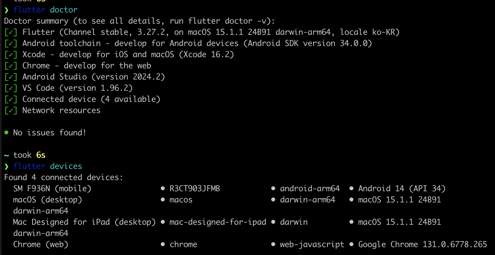

# 설치 ( MacOS + Android )

> MacOS 에 Android 개발환경 구성하는 방법을 기술 [⇧](https://docs.flutter.dev/get-started/install/macos/mobile-android)

## 하드웨어 요구사항

| 내용          | 최소              | 권장              |
| ------------- | ----------------- | ----------------- |
| CPU 코어      | 4                 | 8                 |
| 메모리 (GB)   | 8                 | 16                |
| 해상도 (픽셀) | WXGA (1366 x 768) | FHD (1920 x 1080) |
| 디스크 (GB)   | 44.0              | 70.0              |

## 소프트웨어 요구사항

Rosseta 2 설치가 필요한 경우, 아래 명령어를 실행합니다.

```bash
# Rosetta 2 설치 : Apple Silicon 기반 Mac 에서 Intel 기반 앱 실행을 위한 레이어
sudo softwareupdate --install-rosetta --agree-to-license
```

## 개발 환경 구성

- [Android Studio 설치 2023.3.1 이상 설치](https://developer.android.com/studio/install#mac)
- [Git 2.27 이상 설치](https://formulae.brew.sh/formula/git)
  - `brew install git` 을 통해 설치 가능

## IDE 설치

> 아래 3개 중 택1, 추천 조합은 vscode + flutter extension

- [VsCode](https://code.visualstudio.com/docs/setup/mac) + [Flutter Extension](https://marketplace.visualstudio.com/items?itemName=Dart-Code.flutter)
- [Android Studio](https://developer.android.com/studio/install#mac) + [Flutter Plugin](https://plugins.jetbrains.com/plugin/9212-flutter)
- [IntelliJ IDEA](https://www.jetbrains.com/idea/download/#section=mac) + [Flutter Plugin](https://plugins.jetbrains.com/plugin/9212-flutter) + [Android plugin for InteliJ](https://plugins.jetbrains.com/plugin/22989-android)

## Flutter SDK 설치

> `25.01.21` 기준 최신 버전은 `3.27.2` 입니다. ( Dart 3.6.1 / Dev Tools 2.40.2 )

1. CMD + shift + p 를 눌러서 `Flutter: New Project` 를 검색하면 Flutter SDK 를 설치할 수 있습니다.

2. 설치 이후 터미널에서 `flutter doctor` 를 실행하여 설치가 잘 되었는지 확인합니다.

3. 업그레이드가 필요한 경우 `flutter upgrade` 를 실행합니다.

## 휴대폰 개발자 모드 활성화

> 에뮬레이터를 사용해도 좋으나 실물로 확인하는 것을 추천

- [휴대폰 개발자 모드 활성화](https://developer.android.com/studio/debug/dev-options?hl=ko) : 설정 - 휴대전화정보 - 빌드번호 7번 클릭
- `설정 - 개발자 옵션 - USB 디버깅` 활성화 이후 MAC에 휴대폰 연결 이후 `액세서리 연결 승인` 을 누릅니다.

## 안드로이드 라이센스 동의

> 안드로이드 라이센스 동의가 필요한 경우 아래 명령어를 실행합니다.

```bash
flutter doctor --android-licenses
```

## flutter doctor

> flutter doctor 를 실행하여 설치가 잘 되었는지 확인합니다.

```bash
flutter doctor
```

문제가 있는 경우 `flutter doctor -v` 를 실행하여 자세한 내용을 확인합니다.

## 연결된 디바이스 확인

> 휴대폰을 연결하고 `flutter devices` 를 실행하여 연결된 디바이스를 확인합니다.

```bash
flutter devices
```

## 확인 결과


